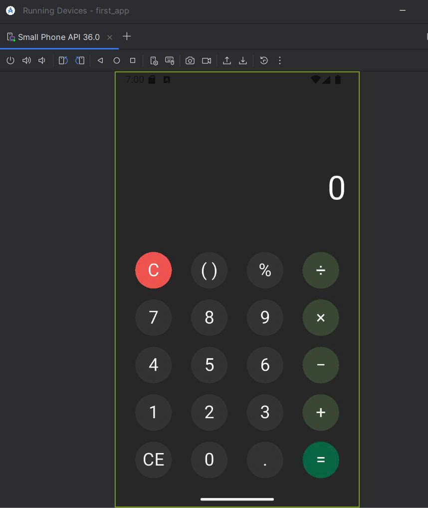

# Flutter Simple Calculator App

Một ứng dụng máy tính cơ bản được xây dựng bằng **Flutter**, phát triển theo yêu cầu của **Chapter 2 – Simple Calculator** trong môn *Phát Triển Ứng Dụng Đa Nền Tảng*.

Ứng dụng được thiết kế theo Figma, xử lý đầy đủ chức năng tính toán và đảm bảo trải nghiệm mượt mà.

---

## Mục tiêu của dự án

Project này giúp sinh viên:

- Hiểu Flutter widget & layout
- Quản lý state trong ứng dụng tương tác
- Xây dựng UI đúng Figma
- Xử lý các phép toán số học
- Kiểm tra & xử lý lỗi người dùng
- Viết mã sạch, có comment

---

## Tính năng ứng dụng

### 1. Hiển thị số theo thời gian thực  
- Hiển thị số đang nhập và kết quả  
- Tự động làm mới khi cần  

### 2. Nhập số (0–9)  
- Ghép số nhiều chữ số  
- Không cho nhập "00000" ở đầu  

### 3. Phép toán cơ bản  
- Cộng (+)  
- Trừ (−)  
- Nhân (×)  
- Chia (÷)  
- Hỗ trợ nhập số âm: `-5 + 3 = -2`  
- Hỗ trợ ưu tiên phép toán: `5 + 3 × 2 = 16`  

### 4. Phím “=”  
- Tính toàn bộ biểu thức  
- Hỗ trợ chain calculation  

### 5. C (Clear All)  
- Reset toàn bộ  

### 6. CE (Clear End)  
- Xóa 1 ký tự cuối  

### 7. Dấu thập phân “.”  
- Chỉ được nhập 1 dấu thập phân  

### 8. Đổi dấu (±)  
- 5 → -5  
- -10 → 10  

### 9. Phần trăm (%)  
- 200% = 2  
- 300 × 10% = 30  

### 10. Xử lý ngoại lệ  
- Chia cho 0 → Error  
- Không cho nhập nhiều toán tử liên tục  
- Giới hạn độ dài số  

---

## Giao diện ứng dụng


https://youtube.com/shorts/5hI2V8cAuaM?feature=share


---

## Công nghệ sử dụng

- Flutter 3.35.5
- Dart  
- Material Widgets  
- State management bằng `setState()`  

---

## Cách cài đặt & chạy project

### 1. Clone project
```bash
git clone https://github.com/NguyenThiThu1710/flutter_calculator_nguyen_thi_thu.git
```

### 2. Cài đặt dependencies
```bash
flutter pub get
```

### 3. Chạy ứng dụng
```bash
flutter run
```
